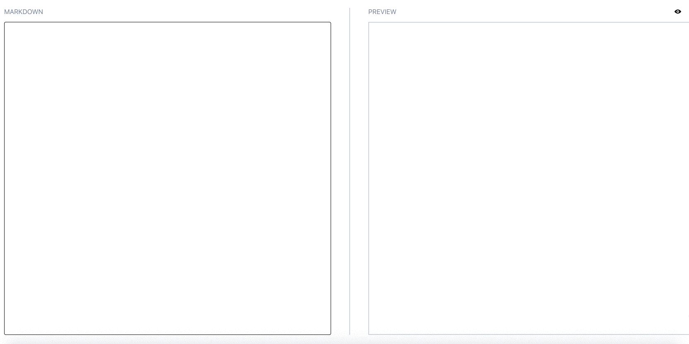

# markdown-preview

A small react app to show the live preview of the markdown. Only supports text, links and headings for now.

## Demo

## Installation

1. Clone the repository using `git clone https://github/akarshit/markdown-preview.git`
1. Go in the cloned directory `cd markdown-preview`
1. Install the dependency `npm install`
1. Start the project with `npm start`
1. Visit `localhost:3000` to access the project

## Usage

Type the markdown on the left hand input and see the live preview on the right.
To see the raw HTML being generated use the switch button on the top-right.
To switch back to preview, click the button again.

Note: The content is not saved. So if you refresh the content will be lost.

### Approach

The initial idea was to implement a line by parser. This would have been much faster, but would hamper both the readability and extendibility of the code a lot.

Since the markdown has a structured grammer, it was easier and more cleaner to use regex to do to the conversion. The code is split into multiple parsers. Each of these parsers has a specific and modular task to do.

To make this process faster, the trick is that once we encounter `\n\n`, the markdown before is independent of the markdown after. So while reading a huge file we can process line by line until we encounter `\n\n`. These chucks can then be collated to return the complete HTML. Another advantage of this is that since the regex is now applied to smaller text, it is much faster.

The two functions are `convert(markdown: string)` and `convertFast(markdown: string)`.
